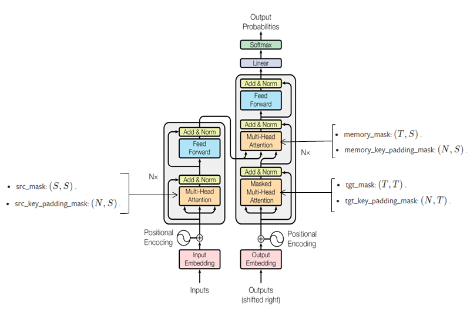

# torch.nn.Transformer
- encoder input으로 들어가는 data의 padding 처리 방식을 2가지로 구현
	* 구현 1: <https://github.com/hccho2/Transformer_DateConversion/blob/master/DateConversion_Transformer_pytorch/transformer_dateconversion1.py>
		- 입력 data 자체를 공백으로 채워 고정길이로 만듬 --> 같은 길이로 만들어졌기 때문에, padding이 필요없다.
	* 구현 2: <https://github.com/hccho2/Transformer_DateConversion/blob/master/DateConversion_Transformer_pytorch/transformer_dateconversion2.py>
		- 입력 data의 길이가 서로 다름. 만들어지는 mini batch내의 sequence는 padding을 통해 길이가 같아지지만, mini batch마다 길이는 달라진다.
		- src_key_padding_mask를 사용하여 encoder input의 padding된 부분에는 attention이 갈 수 없도록 구현

## Pytorch Transformer API
- 먼저 전체 Encoder 구조를 보면, `nn.TransformerEncoderLayer`가 있고, 이를 포함하는 `nn.TransformerEncoder`가 있다.
- Decoder에서도 대칭적으로 `nn.TransformerDecoderLayer`가 있고, 이를 포함하는 `nn.TransformerDecoder`
- 마지막으로 `nn.TransformerEncoder`, `nn.TransformerDecoder`를 결합한 `nn.Transformer`가 있다.
- 모델을 만들때는 `nn.Transformer`만 사용해도 되고, 더 하위의 Layer를 사용해서 정밀하게 설계할 수도 있다.

- API의 padding이 불필요하게 복잡하다. padding이 6개로 나누어져 있다. 2개씩 Multihead Attention으로 들어간다. 

- `(src_mask, src_key_padding_mask )` 는 Encoder로 들어간다.
- `(tgt_mask, tgt_key_padding_mask )`는 Decoder의 self-attention으로 들어간다.
- `(memory_mask, memory_key_padding_mask)`는 Decoder의 위쪽 attention으로 들어간다.
- padding중에서 `tgt_mask`가 가장 중요하다. decoder가 sequence를 생성할 때, 나중에 생성될 sequence가 앞쪽에 영향을 주면 안되기 때문이다. 이를 causal padding이라 부른다.
- `src_key_padding_mask`는 선택적으로 줄 수 있는데, 이는 encoder의 입력 data에서 padding된 부분에는 attention을 줄 수 없도록 한다.
- Tensorflow 구현에서는 2개의 mask가 각각 결합되어 모두 3개의 mask만 사용했다.
- API를 활용하는 방식이라, Attention Plot을 하기 어렵다.
