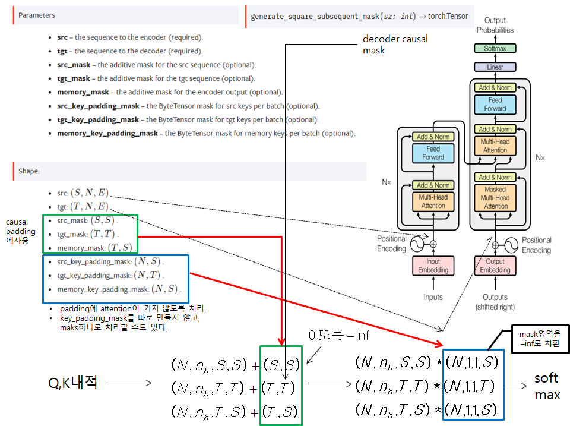

# torch.nn.Transformer
- encoder input으로 들어가는 data의 padding 처리 방식을 2가지로 구현
	* 구현 1: <https://github.com/hccho2/Transformer_DateConversion/blob/master/DateConversion_Transformer_pytorch/transformer_dateconversion1.py>
		- 입력 data 자체를 공백에 채워 고정길이로 만듬 --> 같은 길이로 만들어졌기 때문에, padding이 필요없다.
	* 구현 2: <https://github.com/hccho2/Transformer_DateConversion/blob/master/DateConversion_Transformer_pytorch/transformer_dateconversion2.py>
		- 입력 data가 길이가 다름. 만들어지는 mini batch내의 sequence는 padding을 통해 길이가 같아지지만, mini batch마다 길이는 달라진다.
		- src_key_padding_mask를 사용하여 encoder input의 paddin된 부분에는 attention이 갈 수 없도록 구현

## Pytorch Transformer API

- API의 padding이 불필요하게 복잡하다.
- 6개의 padding을 넣어 줄 수 있다.
- padding중에서 `tgt_mask`이 가장 중요하다. decoder가 sequence를 생성할 때, 나중에 생성될 sequence가 앞쪽에 영향을 주면 안되기 때문이다. 이를 causal padding이라 부른다.
- `src_key_padding_mask`는 선택적으로 줄 수 있는데, 이는 encoder의 입력 data에서 padding된 부분에는 attention을 줄 수 없도록 한다.