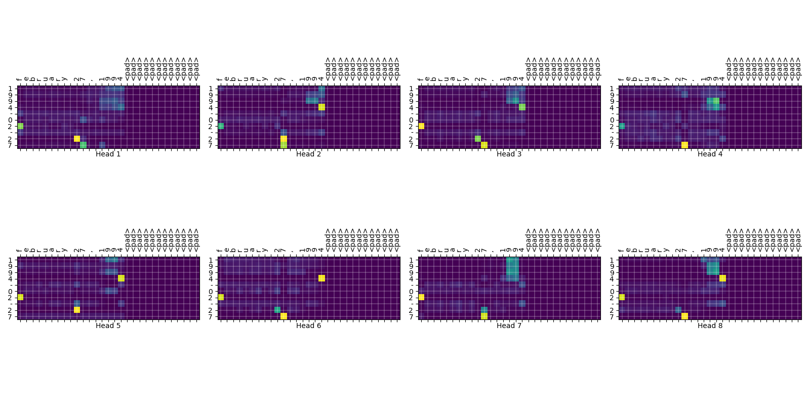
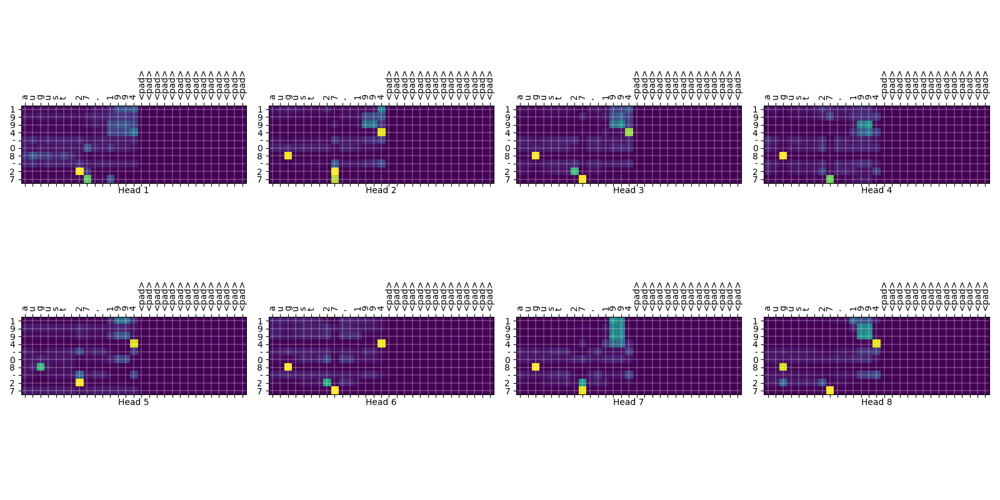

# Transformer Tensorflow 
- Tensorflow를 이용한 구현은 모두 3가지 Framework로 되어 있다. 모두 Tensorflow 기반이므로, 2.x와 keras는 공통 부분이 많다.
	- Tensorflow 2.x Framework: `tf.GradientTape()`를 이용하여 train한다.
	- Keras 방식: `Model.fit`, `Model.predict`
	- Tensorflow 1.x Framework.

## Attention 결과

- `february 27, 1994`: 영어의 월들 철자에 F가 포함된 유일한 월이 February입니다. 모델은 February에서 F에 attention을 (많이) 부여하여 2월로 변환합니다.

- g가 등장하는 유일한 월이 8월입니다. 모델은 August를 만나면 g에 attention을 주어서 8월로 변환합니다.

## Tensorflow 2.x 구현
- tensorflow api에는 transformer가 없고, [tutorial](https://www.tensorflow.org/tutorials/text/transformer)에 transformer 구현이 있다.
- 같은 Trannsformer이기 때문에, Pytorch `nn.Transformer`와 동일하다. `EncoderLayer`, `DecoderLayer`가 있고, 각각 이를 감싸는 `Encoder`, `Decoder`가 있다.
- 이 `Encoder`, `Decoder`를 결합하여 `Transformer`가 만들어졌다.
- `EncoderLayer`, `DecoderLayer`의 핵심은 `MultiHeadAttention`이다.
- 이 tutorial 코드를 기반으로 구현했다.
- Accuracy 측정: accuracy를 character단위로 측정할 수도 있고, sequence전체(YYYY-MM-DD)를 기준으로 측정할 수 있다.

## Keras 구현
- custom layer들이 많기 때문에, keras화 시키는 것이 효율적이지는 못할 수도 있다.
- `fit`활용하는 측면에서 장점이 있기도 하다.
- sequence accuracy를 위해, custom metric `SequenceAccuracy(tf.keras.metrics.Metric)`를 구현했다.
- `fit` 중간에 이루어지는 validation에서는 dropout이 적용되지 않아야 하지만, 구조상 문제로 dropout on 상태로 값을 계산합니다.
