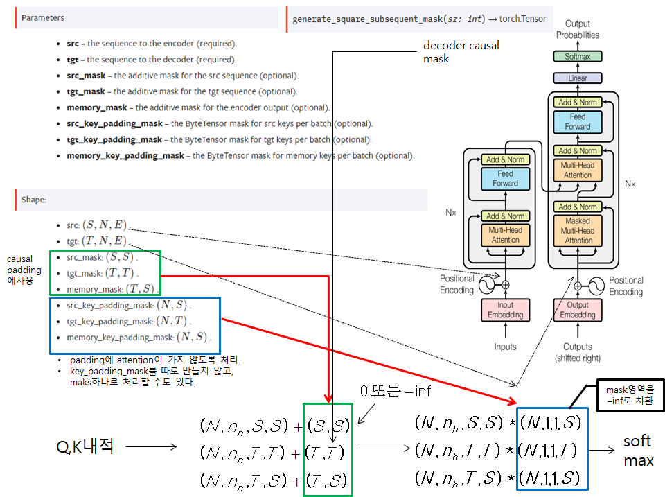

# torch.nn.Transformer
- encoder input으로 들어가는 data의 padding 처리 방식을 2가지로 구현
	* 구현 1
		- 입력 data 자체를 공백을 채워 고정길이로 만듬 --> padding이 필요없고 고정된 길이
	* 구현 2
		- 입력 data가 길이가 다름. 만들어지는 mini batch내의 sequence는 padding을 통해 길이가 같아지지만, mini batch마다 길이는 달라진다.
		- src_key_padding_mask를 사용하여 encoder input의 paddin된 부분에는 attention이 갈 수 없도록 구현

## torchtext

## Pytorch Transformer API

