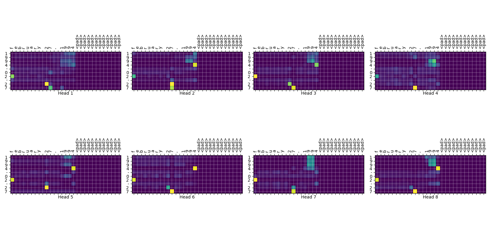
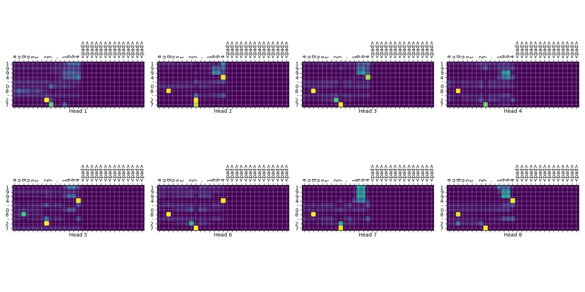

# Transformer Tensorflow 
- Tensorflow를 이용한 구현은 모두 3가지 Framework로 되어 있다. 모두 Tensorflow 기반이므로, 2.x와 keras는 공통 부분이 많다.
	- Tensorflow 2.x Framework: `tf.GradientTape()`를 이용하여 train한다.
	- Keras 방식: `Model.fit`, `Model.predict`
	- Tensorflow 1.x Framework.

## Attention 결과

## Tensorflow 2.x 구현
- tensorflow api에는 transformer가 없고, [tutorial](https://www.tensorflow.org/tutorials/text/transformer)에 transformer 구현이 있다.
- 이 tutorial 코드를 기반으로 구현했다.
- Accuracy 측정: accuracy를 character단위로 측정할 수도 있고, sequence전체(YYYY-MM-DD)가 일치할 때만 일치한 것을도 측정할 수 있다.

## Keras 구현
- custom layer들이 많기 때문에, keras화 시키는 것이 효율적이지는 못할 수도 있다.
- `fit`활용하는 측면에서 장점이 있기도 하다.