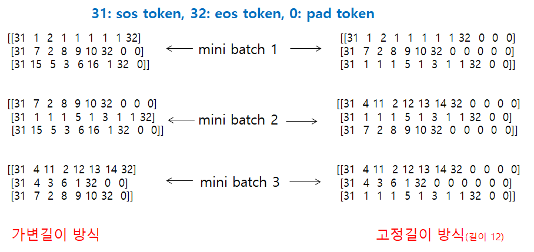

# Date Conversion Transformer: Tensorflow 2.x vs Pytorch vs Keras vs Tensorflow 1.x
## 목적: 다양한 날짜 형식을 YYYY-MM-DD 형식으로 변환
- human readable date를 machine readable date로 변환
- dropout이 적용되어 있어, 오타가 있어서 변환이 된다. 오타가 포함되지 않은 data로 train했다.
- train data에 오타를 포함시키거나, 입력 data에 masking을 하면, 정확도가 향상될 수 있다.
```
september 27, 1994             ==> 1994-09-27
septemer 27, 2194              ==> 1994-09-27   <---- 오타 포함
april 27, 1994                 ==> 1994-04-27
august 19, 2003                ==> 2003-08-19
augut 19, 2003                 ==> 2003-08-19   <---- 오타 포함
2/10/93                        ==> 1993-02-10
10/31/90                       ==> 1990-10-31
tuesday, september 25, 1984    ==> 1984-09-25
jun 17, 2013                   ==> 2013-06-17
```


## Requirements
- torchtext
- hparams
- pandas
- pytorch
- tensorflow 2.2


## 구현 목록
	- Pytorch: torch.nn.Transformer API를 사용.
	- Tensorflow 2.x Framework: `tf.GradientTape()`를 이용하여 train한다.
	- Keras 방식: `Model.fit`, `Model.predict`
	- Tensorflow 1.x Framework: <https://github.com/hccho2/Transformer_DateConversion/tree/master/DateConversion_Transformer_tensorflow_1x>

## Padding
- 2가지 방식의 padding을 살펴보자.

- 가변 길이 방식: mini batch 내에서 가장 긴 sequence를 기준으로 padding이 된다.
- 고정 길이 방식: 고정된 길이가 될 수 있도록 padding을 한다.
- 2가지 방식의 padding이 가능하도록 tensorflow, torchtext에서 api를 제공하고 있다.

## Data Preprocessing: Tensorflow Tokenizer vs torchtext
# Tensorflow-Tokenizer
```
# coding: utf-8

import tensorflow as tf
from konlpy.tag import Okt
okt = Okt()

from tensorflow.keras import preprocessing
samples = ['너 오늘 아주 이뻐 보인다', 
           '나는 오늘 기분이 더러워', 
           '끝내주는데, 좋은 일이 있나봐', 
           '나 좋은 일이 생겼어', 
           '아 오늘 진짜 너무 많이 정말로 짜증나', 
           '환상적인데, 정말 좋은거 같아']

label = [[1], [0], [1], [1], [0], [1]]

morph_sample = [okt.morphs(x) for x in samples]

tokenizer = preprocessing.text.Tokenizer(oov_token="<UKN>")   # oov: out of vocabulary
tokenizer.fit_on_texts(samples+['sos','eos']) 
print(tokenizer.word_index)  # 0에는 아무것도 할당되어 있지 않다.  --> pad를 할당하면 된다.

word_to_index = tokenizer.word_index
word_to_index['PAD'] = 0
index_to_word = dict(map(reversed, word_to_index.items()))

print('word_to_index(pad): ', word_to_index)
print('index_to_word', index_to_word)

sequences = tokenizer.texts_to_sequences(morph_sample)  # 역변환: tokenizer.sequences_to_texts(sequences)
print(sequences)
[[5, 2, 6, 7, 8],
[14, 1, 2, 1, 1, 11],
[12, 1, 3, 4, 1, 1],
[14, 3, 4, 15],
[16, 2, 17, 18, 19, 20, 21],
[1, 1, 1, 1, 23, 3, 1, 25]]

```
- 위에서 얻은 `sequences`에 padding을 붙혀보자.
```
padded_sequence = preprocessing.sequence.pad_sequences(sequences, maxlen=15, padding='post',truncating='post')

[[ 5  2  6  7  8  0  0  0  0  0  0  0  0  0  0]
 [14  1  2  1  1 11  0  0  0  0  0  0  0  0  0]
 [12  1  3  4  1  1  0  0  0  0  0  0  0  0  0]
 [14  3  4 15  0  0  0  0  0  0  0  0  0  0  0]
 [16  2 17 18 19 20 21  0  0  0  0  0  0  0  0]
 [ 1  1  1  1 23  3  1 25  0  0  0  0  0  0  0]]


```
- 위의 결과는 전체 data를 고정 길이로 padding했다. mini-batch별로 가변 길이 padding은 아래에서 tf.data.Dataset을 통해서 만들 수 있다. 구체적인 방식은 아래에서 살펴보자.


# torchtext
```
import torchtext
from konlpy.tag import Okt
samples = ['너 오늘 아주 이뻐 보인다', 
           '나는 오늘 기분이 더러워', 
           '끝내주는데, 좋은 일이 있나봐', 
           '나 좋은 일이 생겼어', 
           '아 오늘 진짜 너무 많이 정말로 짜증나', 
           '환상적인데, 정말 좋은거 같아']

# 1. Field 정의
tokenizer = Okt()
TEXT = torchtext.data.Field(sequential=True, tokenize=tokenizer.morphs,batch_first=True,include_lengths=False)
fields = [('text', TEXT)]

# 2. torchtext.data.Example 생성
sequences=[]
for s in samples:
    sequences.append(torchtext.data.Example.fromlist([s], fields))

for s in sequences:
    print(s.text)

# 3. Dataset생성(word data)
mydataset = torchtext.data.Dataset(sequences,fields)# Example ==> Dataset생성

# 4. vocab 생성
TEXT.build_vocab(mydataset, min_freq=1, max_size=10000)
print(TEXT.vocab.stoi)

# Dataset생성(id로 변환된 data)
mydataset = torchtext.data.Iterator(dataset=mydataset, batch_size = 3)

for d in mydataset:
    print(d.text.numpy())

[[11  2 20 22 16  1  1]
 [ 5  3  6 18  1  1  1]
 [19  2 28 12 15 27 29]]

[[10  4  3  6 24 17  1  1]
 [ 5 13  2  9 21 14  1  1]
 [30 25 23  4 26  3  8  7]]

```
- 위 코드의 결과는 mini-batch중에서 가장 긴 data를 기준으로 padding(padding token = 1)이 된 것을 알 수 있다. Field에서 `fix_length`를 지정하면 고정된 길이의 data를 얻을 수 있다.
```
TEXT = torchtext.data.Field(sequential=True, tokenize=tokenizer.morphs,batch_first=True,include_lengths=False,fix_length=15)

[[ 4 19  6 15  3 21  5  1  1  1  1  1  1  1  1]
 [34  3 12  9 30  8  7 14 13  2  1  1  1  1  1]
 [17  6 26 28  5 24 11  1  1  1  1  1  1  1  1]]
[[16 20  9  8  7 10  3 29  4 23  2  1  1  1  1]
 [ 4  2  8  7 10  3 25 27  5  1  1  1  1  1  1]
 [ 2  2  6 32 18 22 31 33  1  1  1  1  1  1  1]]
```

# tf.data.Dataset
- tf.data.Dataset을 이용해서, mini-batch를 효율적으로 만들 수 있다.
- tensorflow에서 가변길이 방식의 padding을 만드는 방법을 살펴보자. 위의 tensorflow 코드를 이어서 살펴보자.
```
sequences = tokenizer.texts_to_sequences(morph_sample)  # 역변환: tokenizer.sequences_to_texts(sequences)
print(sequences)
[[5, 2, 6, 7, 8],
[14, 1, 2, 1, 1, 11],
[12, 1, 3, 4, 1, 1],
[14, 3, 4, 15],
[16, 2, 17, 18, 19, 20, 21],
[1, 1, 1, 1, 23, 3, 1, 25]]
```
- `tokenizer.texts_to_sequences`로 길이가 다른 list를 얻었다. 길이가 다르기 때문에, 다음과 같이 하면 error가 발생한다. 
```
 tf.data.Dataset.from_tensor_slices(sequences)
```
- `tf.data.Dataset.from_generator`를 이용하는 방법을 사용하면 된다.
```
def gen():
    data_len= len(sequences)
    sos_id = word_to_index['sos']
    eos_id = word_to_index['eos']
    while True:
        sample_ids = np.random.choice(data_len,batch_size, replace=False)
        sample_sequence = np.array(sequences)[sample_ids]
        sample_sequence = [[sos_id]+s+[eos_id] for s in sample_sequence]
        sequence_length = [len(s) for s in sample_sequence]
        max_len = np.max(sequence_length)       
        sample_sequence = preprocessing.sequence.pad_sequences(sample_sequence, maxlen=max_len, padding='post')
        yield sample_sequence

dataset = tf.data.Dataset.from_generator(gen,tf.int32,tf.TensorShape([batch_size,None]))

for i, d in enumerate(dataset):
    print(d.numpy())
    if i > 0: break

[[26 12  1  3  4  1  1 27]
 [26 14  1  2  1  1 11 27]
 [26 14  3  4 15 27  0  0]]

[[26 14  3  4 15 27  0  0  0  0]
 [26 16  2 17 18 19 20 21 27  0]
 [26  1  1  1  1 23  3  1 25 27]]

```
## 날짜 Data 만들기
- train에 사용된 data는 [date.txt](https://github.com/hccho2/Transformer_DateConversion/blob/master/date.txt)
- date.txt를 보면, human_readable dates와 machine_readable_date("YYYY-MM-DD")가 `_`로 연결되어 있다는 것을 알 수 있다. `human readable dates_machine readable dates`
- human_readable dates는 뒷부분을 공백으로 채워서 길이가 모두 29이다.
```
september 27, 1994           _1994-09-27
August 19, 2003              _2003-08-19
2/10/93                      _1993-02-10
10/31/90                     _1990-10-31
TUESDAY, SEPTEMBER 25, 1984  _1984-09-25
JUN 17, 2013                 _2013-06-17
april 3, 1996                _1996-04-03

12345678901234567890123456789_1234567890
```
- 직접 data를 만드려면, 다음 코드를 참고해서 만들면 된다. 최종 data인 date.txt를 만들기 위해서는 추가적인 작업이 필요한데, 여기서는 다루지 않는다(어려운 작업이 아니다). 이미 만들어져 있는 date.txt를 이용할 수도 있다.
```
from faker import Faker  # pip install faker
from tqdm import tqdm
from babel.dates import format_date
import random
FORMATS = ['short','medium','long','full','full','full','full','full','full','full','full','full','full','d MMM YYY','d MMMM YYY',
           'dd MMM YYY','d MMM, YYY','d MMMM, YYY','dd, MMM YYY','d MM YY','d MMMM YYY','MMMM d YYY','MMMM d, YYY','dd.MM.YY']
LOCALES = ['en_US', 'ko']
fake = Faker()
def load_date():
    """
        Loads some fake dates 
        :returns: tuple containing human readable string, machine readable string, and date object
    """
    dt = fake.date_object()  # ---> datetime.date(1983, 8, 11)

    try:
        human_readable = format_date(dt, format=random.choice(FORMATS),  locale='en_US') # locale=random.choice(LOCALES)), locale='en_US'
        human_readable = human_readable.lower()
        human_readable = human_readable.replace(',','')
        machine_readable = dt.isoformat()
        
    except AttributeError as e:
        return None, None, None

    return human_readable, machine_readable, dt

def load_dataset(m):
    """
        Loads a dataset with m examples and vocabularies
        :m: the number of examples to generate
    """
    
    human_vocab = set()
    machine_vocab = set()
    dataset = []
    

    for i in tqdm(range(m)):
        h, m, _ = load_date()
        if h is not None:
            dataset.append((h, m))
            human_vocab.update(tuple(h))
            machine_vocab.update(tuple(m))
    
    human = dict(zip(sorted(human_vocab) + ['<unk>', '<pad>'], 
                     list(range(len(human_vocab) + 2))))
    inv_machine = dict(enumerate(sorted(machine_vocab)))
    machine = {v:k for k,v in inv_machine.items()}
 
    return dataset, human, machine, inv_machine

#dataset, human_vocab, machine_vocab, inv_machine_vocab = load_dataset(10)

for i in range(10):
    print(load_date())

```


## References
- <https://www.tensorflow.org/tutorials/text/transformer>
- <https://pytorch.org/tutorials/beginner/transformer_tutorial.html>
- Coursera - Neural machine translation with attention
- <https://www.github.com/kyubyong/transformer>